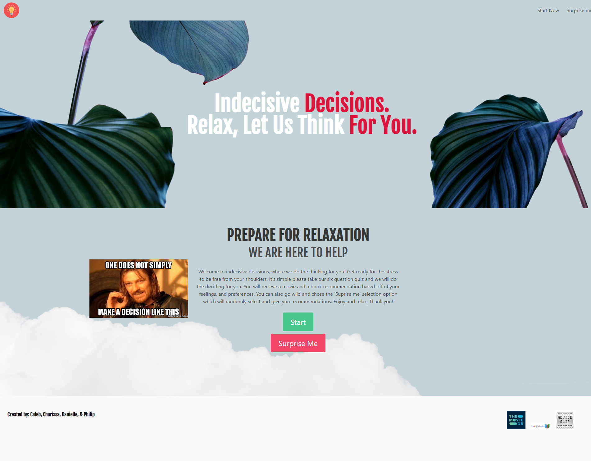

# Indecisive Decision Webpage - Project 1

Authored by Caleb, Charissa, Danielle, & Philip on 05/23/2022

## Description

    This is a site made to ease the load off of it's users when coming to a decision. A decision that may seem simple but is most of the time not. We as a group felt that we have all run in to a constant problem when it comes to picking our source of entertainment. We've all spun in circles rewatching comfort shows and re reading books on the basis of it being easier that way. So we collectively decided to make a site which decides for users, not only to take the stress of choosing away but also to widen the users horizons in entertainment. In our site users are welcomed in to take a quick and easy quiz on the basis of your feelings and preferences. Once all of our questions have been answered it automatically generates a random movie as well as a random book with a description of each based off of the users answers. If users dont like or maybe have already seen this movie or read this book than the users can easily hit the try again button which re generates anew book and movie based oof your same answers. You will also be able to change your answers with the push of a start over button. Another option before users take the quiz would be to have a random book and movie chosen for users by selecting the suprise me button. At the bottom of our site users will find credits to us devlopers as well as to our apis used in the making of this site. Thank you and enjoy as we help users relax and broden the horizons of entertainment.

## Code Functionalities

List notes and features here 

## Website Access

### URL Live Webpage:

[Link to website](https://maradear.github.io/IndecisiveDecision/)

### GitHub Repo:

https://github.com/MaraDear/IndecisiveDecision.git

## Future improvement opportunities

Add gaming recommendations 
Include where the suggestions are available to watch 

### Minimum customer criteria

The group project must meet the following requirements: 
Use a CSS framework other than Bootstrap. 
Be deployed to GitHub Pages. 
Be interactive (i.e., accept and respond to user input). 
Use at least two server-side APIs. 
Does not use alerts, confirms, or prompts (use modals). 
Use client-side storage to store persistent data. 
Be responsive. 
Have a polished UI. 
Have a clean repository that meets quality coding standards (file structure, naming conventions, follows best practices for class/id naming conventions, indentation, quality comments, etc.). 
Have a quality README (with unique name, description, technologies used, screenshot, and link to deployed application). 
Finally, you must add your project to the portfolio that you created in Module 2. 
